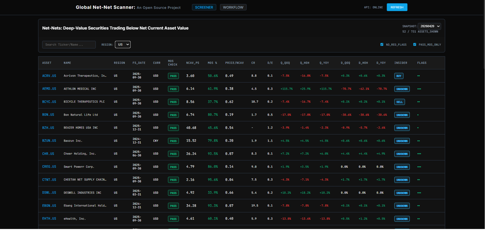
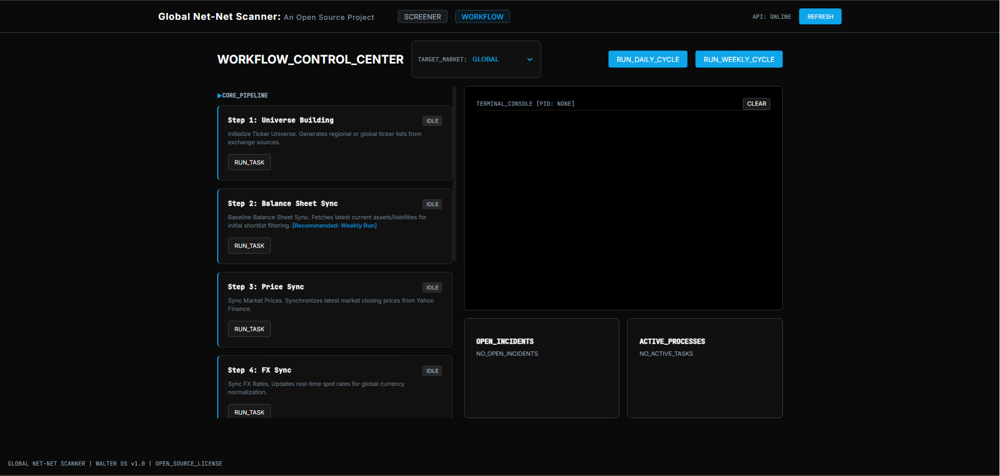

# **Global Net-Net Stock Scanner (Open Source)**

A multidisciplinary project rooted in the tradition of Benjamin Graham and the rationalism of Graham-and-Doddsville.

This is a fully automated global NCAV (Net Current Asset Value) scanner covering the U.S., Japan, Hong Kong, and Thailand. I built it because manually searching for net-nets across markets was slow, fragmented, and error-prone. I wanted a transparent and reproducible system — something I wish I had when I first started studying deep-value investing.

It is open-source by design. If this helps even one investor, researcher, or student the way it helps me, that is enough. Graham democratized value investing and gave ordinary people a framework for moderate prosperity. This project is simply a continuation of that spirit.

---

## **The High-Density Dashboard**

The system features a professional-grade financial terminal for monitoring global net-nets in real-time.



### **What This Project Does**

The scanner builds a global ticker universe, evaluates every company trading below its net current asset value, fetches fundamentals, normalizes currencies, checks solvency and insider behavior, and outputs structured valuation files.

The goal is to answer this question:
**Which companies in the world are trading below their net liquidation value?**

### **Capabilities at a Glance**

* **Unified Global Universe**: US, JP, HK, and TH exchanges (extendable to any market).
* **Automated Fundamentals**: Fetches and caches data from Yahoo Finance + SEC EDGAR.
* **Deterministic Valuation**: Full NCAV and Price-to-NCAV computation.
* **Margin of Safety Flags**: Graham’s 2/3 NCAV margin-of-safety signal.
* **Quality Heuristics**: Liquidity (Current Ratio), Solvency (D/E), and Dilution checks.
* **Insider Intelligence**: Tracks Net Buying/Selling behavior over the last 6 months.

---

## **Key Features & Substance**

### **NCAV & Valuation Math**
* **NCAV Formula**: `Current Assets – Total Liabilities`.
* **Price < NCAV/share**: Automated flag for assets trading at a discount to book.
* **2/3 NCAV MoS**: Deep-value flag for high-conviction opportunities.
* **Price-to-NCAV Ratio**: Real-time Relative valuation metric.

### **Financial Quality**
* **Current Ratio**: Minimum liquidity thresholding.
* **Debt-to-Equity**: Solvency check to ensure capital structure stability.
* **NCAV Trends**: Trailing QoQ, HoH, and YoY trend analysis to detect asset erosion.
* **Stale Filing Detection**: Flags companies with outdated reporting.

### **Capital Discipline & Insider Activity**
* **Share Count Trends**: Detects dilution or share buybacks over 1y and 3y intervals.
* **Insider Activity**: Net Buy/Sell signals within the last 6 months + transaction history.
* **Insider % Held**: Institutional and insider ownership tracking.

---

## **Automated Workflow Control**

The scanner is orchestrated through a dedicated control center that manages the multi-stage data pipeline, ensuring deterministic and reproducible results.



### **The Automated Pipeline**

The system follows a strict lifecycle to build global shortlists:

1.  **Universe Building**: Generates regional ticker lists from exchange sources.
2.  **NCAV Cache Update**: Fetches balance sheet items for the entire universe.
3.  **Price & FX Sync**: Synchronizes latest market prices and real-time FX spot rates (Yahoo Finance).
4.  **Shortlist Generation**: Filters the universe down to assets trading below NCAV.
5.  **Full Fundamental Fetch**: Deep-dives into cash flows, capital structure, and insider behavior.
6.  **Screening Engine**: Produces final structured reports (CSV/JSON/UI).

---

## **Quickstart (Workflow Orchestration)**

### **1. Setup**
```bash
git clone https://github.com/paweenawitch/global_net_net_scanner.git
cd global_net_net_scanner
pip install -r requirements.txt
```

### **2. Launch the Application**

For a seamless experience, you can launch the entire system (Backend API + Frontend UI) by simply running the batch file:

* **Windows**: Double-click `run_scanner.bat` in the root directory.

### **3. Step-by-Step Protocol (CLI)**

The scanner pipeline is designed to be flexible. You can choose to scan the entire **Global Universe** (takes longer) or focus on a **Specific Region**.

#### **Phase 1: Build the Universe**
First, generate the ticker lists. This command builds local CSVs for all supported regions and a combined global file.
```bash
python -m application.cli.build_universe
```
*Outputs are saved to `data/tickers/` (e.g., `us_full.csv`, `jp_full.csv`, `global_full.csv`).*

#### **Phase 2: Choose Your Scope**
Select which ticker file you want to process. For a "Newbie" run, we recommend starting with a single region (e.g., `hk_full.csv`) to verify the flow before running the full global set.

#### **Phase 3: Data Orchestration**
Run these in sequence, replacing `<universe_csv>` with your chosen file (e.g., `data/tickers/hk_full.csv` or `data/tickers/global_full.csv`).

**1. Update NCAV Cache** (Balance sheet fetch)
```bash
python -m application.cli.update_ncav_cache --csv <universe_csv>
```

**2. Update Prices & FX Sync**
```bash
python -m application.cli.update_prices_cache --csv <universe_csv>
python -m application.cli.update_fx_cache
```

**3. Build Shortlist & Fundamentals**
```bash
python -m application.cli.main_build_shortlist_cache_only --tickers_csv <universe_csv>
python -m application.cli.main_fetch_full_cache 
```

**4. Run Final Screening Engine**
```bash
python -m application.cli.run_screening
```

---

## **Architecture Overview**

The codebase follows **Clean Architecture** principles to ensure all financial operations are decoupled and deterministic.

```
domain/
    models/        # Core entities: Company, FinancialSnapshot, ValuationResult
    services/      # Pure logic: NCAV math, FX normalization, Flag heuristics

application/
    cli/           # Automated workflow orchestrators
    services/      # Coordination: Screening service, Market registry

infrastructure/
    sources/       # Adapters: SEC Edgar, Yahoo Finance, JPX, HKEX
    repositories/  # Persistence: SQLite storage, cached price/FX loaders
    fx/            # Exchange-rate providers
```

---

## **Contributions**

Contributions are welcome, especially around:
* Additional global exchanges
* FX improvements and fallback providers
* Performance and concurrency optimizations
* Test suites for financial math verification

---

## **License**
MIT — free for personal, academic, and commercial use.
