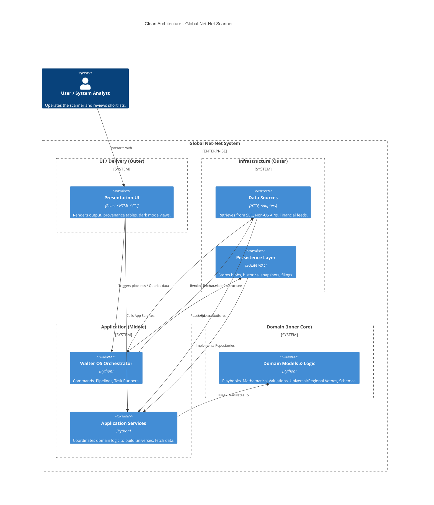

# Software Architecture

This project strictly adheres to **Uncle Bob's Clean Architecture**, enforcing a unidirectional dependency rule where outer layers (infrastructure, tools, application) depend on the inner layers (domain), but the inner layers have no knowledge of the outside world.

## C4 Model Context & Container View

## Layer Constraints
- **Domain Layer**: Absolutely ZERO imports from `application`, `infrastructure`, or `ui`. Enforced via AST tests logic. Mathematical rules and Playbooks live here.
- **Application Layer**: Orchestrates use cases. Operates on Domain entities. Defines interfaces (Ports) that outer layers implement.
- **Infrastructure Layer**: Implements SQLite persistent stores and API scrapers. Knows about HTTP, filesystems, database sessions.
- **UI Layer**: Reaps the data, handles strictly presentation concerns displaying Domain deterministic outputs structurally.
